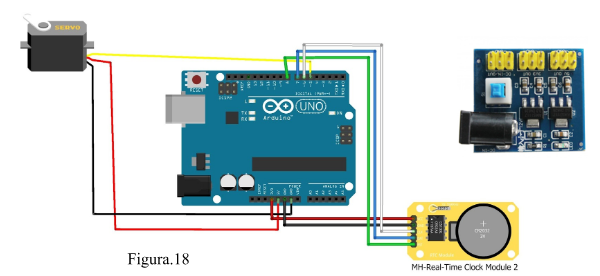
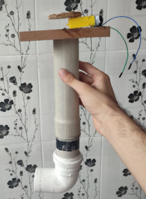
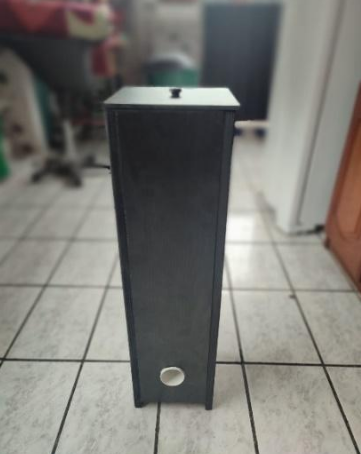
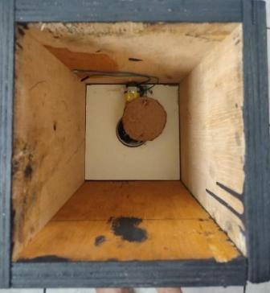

# :dog2: HungryPet Comedouro 

Dispensor de ração programável utilizando arduino desenvolvido para a disciplina de Projeto de Engenharia I da Faculdade de Computação e Telecomunicações da Universidade Federal do Pará.

## :wrench: Componentes Utilizados
 
- Arduino Uno 
- Servo motor com rotação 180º
- Célula de carga
- Jumpers e Expansores de Portas 
- RTC (circuito relógio) 
- Estrutura de MDF
- Expansor de portas

  

## :white_check_mark: Conclusão  

  

    
    
    
   

  

